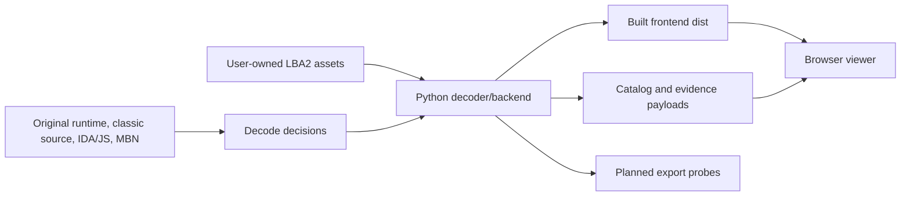

# LBA2 LM2 Viewer Architecture

## System Shape

LBA2 LM2 Viewer is a local reverse-engineering tool for Little Big Adventure 2
model and animation assets.

It has three runtime layers:

- Python decoder and backend package in `lba2_lm2_viewer/`
- Vite/TypeScript/Three.js frontend in `frontend/`
- User-owned LBA2 asset files selected at runtime

The package ships no game data. HQR archives, decoded models, textures, and
animations are local evidence inputs only.



## Current Repository Map

| Path | Role |
| --- | --- |
| `lba2_lm2_viewer/viewer.py` | Backend server, CLI, catalog building, current LM2/animation parsing, palette/texture loading |
| `lba2_lm2_viewer/lba_hqr.py` | HQR table and resource-entry decoding |
| `lba2_lm2_viewer/body_metadata.json` | Local metadata for BODY catalog labels |
| `frontend/src/` | Browser UI, catalog, Three.js scene, model mesh rendering |
| `frontend/vite.config.ts` | Builds frontend into `lba2_lm2_viewer/frontend/dist/` |
| `scripts/build.py` | One-command developer build |
| `scripts/package.py` | Release zip and wheel build |
| `tests/` | Python characterization and regression tests |
| `viewer.py`, `lba_hqr.py` | Compatibility wrappers |
| `docs/` | Source-of-truth docs pack |

## Current Runtime Flow

1. `lba2-lm2-viewer` starts the Python backend.
2. The backend serves built frontend files from
   `lba2_lm2_viewer/frontend/dist/`.
3. The user picks an asset folder or selected HQR files.
4. The backend catalogs HQR entries and decodes known model, animation, palette,
   and texture data.
5. The frontend requests catalog/model JSON and renders decoded models with
   Three.js.

## Current Decode Boundaries

Implemented:

- HQR table parsing and resource-entry decompression.
- BODY/LM2 model parsing for vertices, bones, normals, polygons, lines, spheres,
  UV groups, bounds, and selected flags.
- RESS palette and texture atlas decode needed by current model rendering.
- ANIM and ANIM3DS catalog entries with summary/raw metadata.

Planned:

- Full ANIM semantic records and frame stepping.
- ANIM3DS semantic decode once evidence identifies the layout.
- Export probes and contract manifests.
- Read-only texture/UV inspector.

## Frontend Boundary

The frontend is an inspection surface, not the source of decode truth. It may
optimize payloads for rendering and interaction, but parser semantics must live
in reusable backend modules.

`/model.json` can remain a Three.js-friendly render payload. Evidence manifests
should be separate outputs derived from the same decoded structures.

## Planned Module Direction

`viewer.py` currently carries too many responsibilities. Future work should
extract narrow modules only when needed:

```text
lba2_lm2_viewer/
  parsers/
    lm2.py
    animation.py
    textures.py
  catalog.py
  contracts/
    model_contract.py
  exports/
    probe.py
    obj.py
    textures.py
  server.py
  viewer.py
```

This is a target shape, not current fact. Do not do a broad extraction just to
match the tree. Let export and animation work pull out cohesive modules.

## Data and Licensing Boundary

Do not commit:

- HQR archives
- extracted `.lm2` or `.ldc` files
- decoded textures or atlases from real game assets
- decoded animation payloads from real game assets
- generated export bundles from real game assets

Commit only code, docs, synthetic fixtures, and metadata that points to
user-owned asset ids.

## External Tools

External tools are evidence aids:

- Original runtime is the strongest behavior oracle.
- MBN model viewer and decompilation inform layout, interpolation, and render
  behavior.
- Classic source and IDA/JS notes can explain semantics and edge cases.
- Blender is appropriate for UV editing experiments on exported probes.

Edited external assets are hypotheses. Decoder fixes must flow back into code,
tests, and evidence docs.
